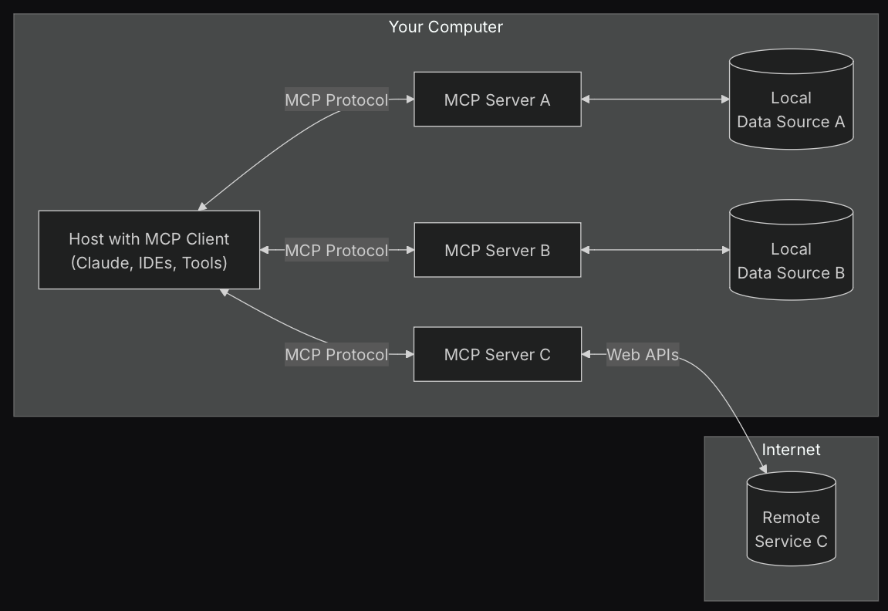

# Architecture of the Model Context Protocol (MCP)

The Model Context Protocol (MCP) is designed around a client-server architecture that facilitates seamless communication between various components in AI applications. This architecture allows for flexibility and scalability, enabling developers to build robust systems that can integrate with multiple data sources and tools.

## General Architecture

At its core, MCP follows a client-server model where:

- **MCP Hosts**: These are applications or tools (like Claude Desktop, IDEs, or other AI tools) that utilize the MCP to access data and functionalities.
- **MCP Clients**: These are protocol clients that maintain a 1:1 connection with the MCP servers, enabling them to send requests and receive responses.
- **MCP Servers**: Lightweight programs that expose specific capabilities through the standardized Model Context Protocol, allowing clients to interact with various data sources and tools.

### Components Interaction

The interaction between the components can be visualized as follows:

1. **Local Data Sources**: These include files, databases, and services on the user's computer that MCP servers can access securely.
2. **Remote Services**: External systems available over the internet (e.g., through APIs) that MCP servers can connect to.
3. **Web APIs**: Interfaces that allow communication between different software applications, enabling data exchange and functionality integration.

### Benefits of the Architecture

- **Scalability**: The architecture allows for easy addition of new servers and clients, accommodating growing needs.
- **Flexibility**: Developers can switch between different LLM providers and vendors without significant changes to the overall system.
- **Security**: Best practices for securing data within the infrastructure are integral to the MCP architecture, ensuring that sensitive information is protected.

This architecture not only enhances the capabilities of LLMs but also streamlines the development process, making it easier for developers to create complex workflows and agents that leverage the power of AI.